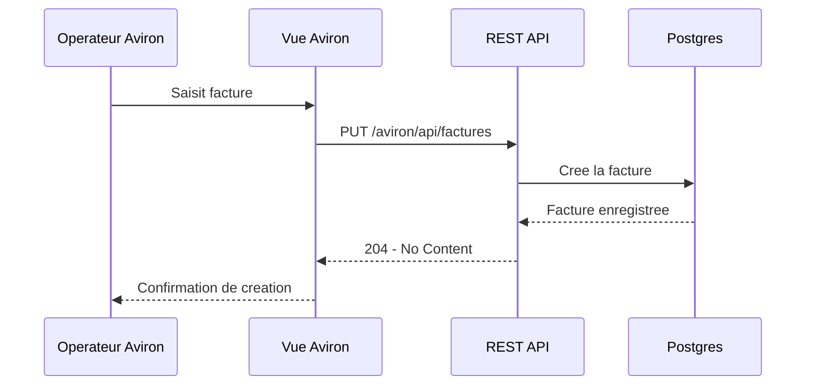
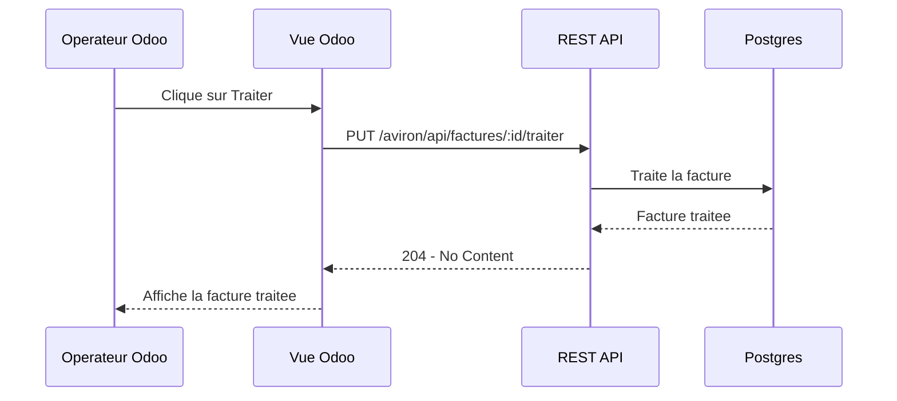
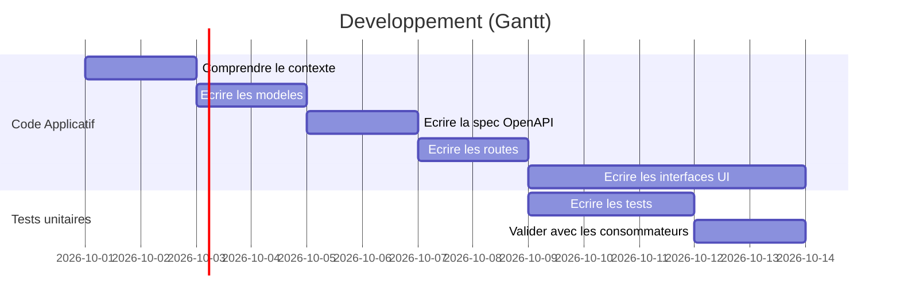

# Documentation

## I. Introduction

Ceci est une application web qui illustre un échange de factures entre Aviron et Odoo. Aviron saisit une facture et Odoo consulte les factures disponibles. Les factures sont stockées dans une base Postgres et exposées par une REST API.

## II. Description des environnements

### Environnement de developpement

Le projet est ecrit en TypeScript et s'exécute avec Node.js. Express fournit le serveur HTTP, Sequelize assure l'accès aux données et Jest exécute les tests unitaires. Les sources sont compilées dans `dist/`. Le script de construction copie également les vues HTML dans ce repertoire.

Commandes disponibles:

```bash
npm run build # Fait la construction du programme
npm test # Lance les tests unitaires
npm run lint # Lance le linteur eslint
npm run dev # Lance l'environnement de dev
```

`npm run dev` reconstruit l'application lorsque les fichiers TypeScript ou HTML changent, puis démarre le service. Le serveur écoute sur le port `8080`.

### Environnement de production

Le dépôt contient un `Dockerfile` basé sur `node:24-alpine` et un fichier Docker Compose qui déclare:

  1. L'application d'échange de données
  2. Postges 17

L'application est deployée chez le fournisseur AWS en tant qu'instance EC2 Linux de taille `t3.large` et les données sont exposées via un ALB et Route 53.

Le serveur démarre l'application en lancant `make`. Celui-ci comporte déjà les requis logiciels nécessaires afin de lancer le serveur.

## Base de données

En production, l'application se connecte à Postgres sur `db:5432`. Sequelize authentifie la connexion et syncronize les modèles au démarrage.

La base de données a un stockage persistant, mais malgré tout une tâche planifiee s'occupe de faire une sauvegarde des données et les mettre encryptées sur un bucket S3 privé.

## III. Analyse

### Etendue du projet

Le péremètre implémenté couvre:

  - La saisie d'une facture dans Aviron;
  - La création, la lecture et le traitement d'une facture par l'API;
  - L'affichage paginé des factures dans l'interface Odoo;
  - Le traitement des factures dans l'interface Odoo;
  - La persistance de l'état de traitement et de la date de consultation.
  - Odoo doit permettree de traiter toutes les factures d'un coup.
  - Les appels API doivent être protégés par authentification par jeton (Bearer).

### Specifications fonctionnelles

Il faut:

  - Pouvoir saisir une facture dans Aviron.
  - Pouvoir consulter et traiter les factures dans Odoo.
  - Qu'Odoo utilise les données d'Avrion.
  - Que traitement et la consultation d'une facture via Odoo mette à jour la base de données chez Aviron.
  - Que la base de données ne soit accessible que par Aviron.

### Cas d'utilisation

| Acteur           | Cas                    | Resultat                                                             |
| ---------------- | ---------------------- | -------------------------------------------------------------------- |
| Operateur Aviron | Saisir une facture     | Une facture non traitee est cree dans la base de donnees Aviron      |
| Operateur Odoo   | Consulter les factures | La liste des factures est chargee d'Aviron et paginee                |
| API Aviron       | Traiter une facture    | Son statut passe à traité et sa date de consultation est mise à jour |
| API Aviron       | Afficher une facture   | La facture correspondant a son identifiant est retournee             |

## IV. Conception

### Diagrammes de classes

TODO: mettre le diagramme de classes uml

### Sequence de creation



### Sequence de traitement



### REST API

| Methode | Route                              | Description                        | Reponse |
| ------- | ---------------------------------- | ---------------------------------- | ------- |
| `GET`   | `/aviron/api/factures`             | Obtention des factures             | 200     |
| `PUT`   | `/aviron/api/factures`             | Cree une facture                   | 204     |
| `GET`   | `/aviron/api/factures/:id`         | Obtention d'une facture par son ID | 200     |
| `PUT`   | `/aviron/api/factures/:id/traiter` | Traite une facture par son ID      | 200     |

## V. Planification



## VI. Developpement

### Organisation du code

| Repertoire ou fichier | Responsabilité                                                    |
| --------------------- | ----------------------------------------------------------------- |
| `src/index.ts`        | Point d'entree, enregistrement des routes, de la DB et du loggeur |
| `src/database.ts`     | Objet de connexion reutilisable Sequelize                         |
| `src/controllers/**`  | Les controlleurs (appeles par les routes, appellent les vues)     |
| `src/models/**`       | Les modeles (sont appeles par les controlleurs)                   |
| `src/routes/**`       | Les routes a enregistrer selon l'application                      |
| `src/views/**`        | Les fichiers de rendu HTML a servir directement par Express       |
| `__tests__/**`        | Les tests unitaires                                               |

### Structure de la base de donnees

Table `facture`:

| Colonne            | Type      | Contraintes                           | Description                             |
| ------------------ | --------- | ------------------------------------- | --------------------------------------- |
| `id`               | UUID      | Cle primaire, generee automatiquement | Indentifiant unique de la facture       |
| `numero`           | VARCHAR   | Obligatoire                           | Numero de la facture                    |
| `dateEmission`     | TIMESTAMP | Obligatoire                           | Date de la creation de la facture       |
| `dateConsultation` | TIMESTAMP | Facultatif                            | Date a laquelle la facture est traitee. |
| `statutStraitee`   | BOOLEAN   | Obligatoire, faux par defaut          | Indique si la facture a ete traitee     |

Script SQL: TODO: mettre le script sql

### Tests

TODO: mettre les cas de tests

### VII. Deploiement

Sur Windows:

  1. Installer les dependances avec `npm ci`
  2. Compiler avec `npm run build`
  3. Servir l'application avec `node dist/src/index.js`

Sur Linux/macOS:

  1. Lancer `make`
